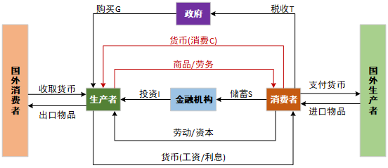

学习炒股的第二天。

<!--more-->

参考链接：

- https://datawhalechina.github.io/whale-quant

## 一、金融投资

1. 金融投资的前身：资产投资——出钱建厂生产（资本持有者亲自参与生产）
2. 金融投资产生的原因：占有资本和运用资本的分离——随着商品经济的发展，资本主义投资规模不断扩大，单个资本家的资本实力越来越难以满足日益扩大的投资规模对庞大资本的需求，迫切需要超出自身资本范围从社会筹集投资资金，于是，银行信用制度得到了迅速的发展，股份制经济也应运而生，银行信贷、发行股票、债券日益成为投资资金的重要来源。

## 二、个人投资者投资品种

- 股票投资：包括A股、港股、美股等，是高风险高收益的投资品类。投资者选股并买入股票后，如果股价上涨，投资者就获益；如果股价下跌，投资者就遭受损失。
- 基金投资：主要指证券投资基金。与股票相比，基金投资不需要自行选股，相对更为省心。
- 债券投资：包括国债、金融债券、公司债券等。相对股票、基金投资来说，债券投资风险较低，同时收益也较低。
- 房地产投资：在自住之外，再购入多套房，就属于房地产投资。房地产投资金额一般较大，如果房价上涨，获利比较可观；但变现周期较长，且存在政策调控带来的房价下跌风险。

## 三、宏观经济学基础

1. 宏观经济的定义：宏观经济学在宏观范畴以全局视角观察经济现象；微观经济学研究的是微观个体之间的供需关系，核心是反映市场的价格理论。
2. 经济危机的原因：有效需求（有支付购买能力的需求）不足：

   ```text
   有效需求不足 → 资源被闲置 → 工厂减产 → 工厂解雇，失业增加 → 消费降低 → 库存积压，闲置增加 → 工厂减产 → 工厂解雇，失业增加 → 消费降低 → ……
   ```
3. **宏观经济学强调政府在市场调节中的作用**
4. 在宏观经济学中，看待一个国家经济，可以考虑其国内生产总值GDP，或者说是国民收入Y。而国民收入和消费C、投资I、政府购买G、净出口（出口X-进口M）有关，也就是常说的拉动经济的四驾马车。

   $$
   GDP = Y = C + I + G + (X - M)
   $$

   - 含义：本国生产出来的东西，最终被谁买走了（本国公民、国家政府、出口-进口）。

   在这个问题上，凯恩斯给出的分析是：

   - 边际消费倾向递减 → 消费意愿降低 → C降低
   - 资本边际效率递减 → 资本家投资意愿降低 → I降低
   - 流动性偏好 → 货币需求和供给
5. **宏观变化经过时间传导最终会在微观层面体现。**并且最直接的，大量的股票和债券直接和宏观经济相关，比如“经济上行，通胀上行”时，增加了持有现金的机会成本，可能出台的加息政策会降低债券吸引力，股票的配置价值较强，而商品将明显走高。

## 四、宏观经济分析

参考链接：

- https://datawhalechina.github.io/whale-quant

### 1. 国内生产总值（GDP）

国内生产总值（Gross Domestic Product，简称GDP），是一个国家（或地区）所有常住单位在一定时期内生产活动的最终成果。GDP是国民经济核算的核心指标，也是衡量一个国家或地区经济状况和发展水平的重要指标。GDP增长率越高，代表经济发展越快，投资市场也越好。

GDP构成与核算有三种方法：

1. 支出法：用一定时期内整个社会购买最终产品的总支出来计算GDP

   $$
   GDP = Y = C + I + G + (X - M)
   $$

   - C：个人消费
   - I：国内总投资
   - G：政府购买
   - X：出口
   - M：进口
2. 收入法（成本法）：用生产要素在生产中所得到的各种收入加总来计算GDP。由于要素收入从企业角度看即是产品成本（包括企业利润），所以这种方法又称要素成本法。
3. 生产法（部门法）：把所有企业投入的生产要素新创造出的产品和服务在市场上的销售价值，按产业部门分类汇总来计算GDP。

### 2. 边际消费倾向（MPC）

1. MPC 定义：居民增加的消费 $\Delta C$ 和增加的收入 $\Delta Y$ 之间的比值。

   $$
   MPC = \frac{\Delta C}{\Delta Y}
   $$

   它既包含了居民主观消费意愿的影响，也叠加了收入水平、刚性支出、预防性储蓄、消费环境等一系列客观约束。我们日常看到的 MPC 下降，很多时候并非居民「不想消费」，而是「不敢消费、不能消费」，不能简单等同于居民消费意愿下滑。
2. 国民收入决定方程：从消费角度观察国民收入。

   $$
   C = \alpha + \beta Y
   $$

   其中，$C$ 表示总消费，$Y$ 表示收入，$\alpha$ 表示自主消费，$\beta$ 表示边际消费倾向 MPC，取值范围为 $0 < \beta < 1$。
3. 将消费函数代入 GDP 公式，不考虑净出口（即考虑三部门经济）：

   $$
   Y = \alpha + \beta Y + I + G
   $$

   $$
   Y(1 - \beta) = \alpha + I + G
   $$

   $$
   Y = \frac{1}{1 - \beta}(\alpha + I + G)
   $$

### 3. 资本边际效率（MEC）

#### 3.1 资本边际效率递减

资本边际效率是凯恩斯提出的一个概念，按照他的定义，资本边际效率是一种贴现率，这种贴现率正好使一项资本物品的使用期内各预期收益的现值之和等于这项资本品的供给价格或者重置资本。资本边际效率是凯恩斯所说造成有效需求不足的三个基本心理因素之一。凯恩斯的资本边际效率，指的是预期增加一个单位投资可以得到的利润率。

#### 3.2 IS 方程

对于投资和利率，凯恩斯认为存在投资函数：

$$
I = e - dr
$$

其中，$I$ 为投资量，$e$ 为自主投资，$d$ 为投资需求对利率变动的敏感系数，表示利率每上升或下降一个百分点，投资会减少或增加的数量，$r$ 表示利率。

将投资函数和消费函数代入GDP公式，不考虑净出口（即考虑三部门经济）：

$$
Y = \alpha + \beta Y + e - dr + G
$$

$$
Y(1 - \beta) = \alpha + e - dr + G
$$

$$
Y = \frac{1}{1 - \beta}(\alpha + e - dr + G)
$$

这就构成了收入Y和利率r之间的函数。

### 4. 流动性偏好

凯恩斯将人们愿意持有货币 $L$（或存款）的动机称为流动性偏好。是指货币具有更强的使用灵活性，人们愿意将一部分财富以货币形式持有。而造成这种现象的动机有三种：

1. 交易动机：个人或企业为了进行正常的交易活动；
2. 预防动机：预防意外的发生而持有的一部分货币；
3. 投机动机：为了抓住某一可能快速盈利的投资机会。

其中，交易动机和预防动机所产生的货币需求用 $L_1$ 表示，并与收入 $Y$ 成正比：

$$
L_1 = kY
$$

而投机动机所产生的货币需求量 $L_2$ 取决于利率 $r$：

$$
L_2 = -hr
$$

其中，$h$ 为货币投机需求的利率系数，负号表示货币投机需求与利率变动存在反向变化关系。所以总的货币需求为：

$$
L = L_1 + L_2 = kY - hr
$$

注意：**GDP 越高，全社会的总收入就越高，人们不仅有更多的钱用于日常交易，也有能力、有必要拿出更多的钱应对意外风险，预防动机的货币需求自然同步上升，因此和 GDP 呈稳定的正比关系** 。在凯恩斯的封闭经济框架里， **总产出（GDP）≡总收入** 。GDP 增长的本质，是全社会个人、企业的总收入同步增长，预防动机的主体是个人和企业，最终是「收入增长」传导到了「预防货币需求增长」，GDP 是这个关系的宏观统计体现。凯恩斯在《就业、利息和货币通论》里，把交易、预防动机合并为 L1=kY，核心原因是：二者持有的货币，都是为了「确定性 / 半确定性的支付需求」，对利率变动极不敏感 —— 你不会因为银行存款利率涨了 0.5%，就把预留的应急生活费拿去存定期，流动性永远是第一位的。因此，收入就成了这两类货币需求的唯一核心决定因素。而预防动机持有的货币，本质是 **储蓄里的高流动性部分** （活期存款、现金）。当 GDP 上升，总收入增加，哪怕全社会的储蓄率不变，储蓄的绝对规模也会同步上升，其中用于预防意外的流动性货币持有量，自然会同步增长。

#### 4.1 LM 曲线

有货币需求，就会有货币供给，假设央行发行货币量 $M$（在短期内可以理解为一个常数），以能够使得货币市场均衡 $L = M$：

$$
L = M
$$

$$
M = kY - hr
$$

$$
Y = \frac{M}{k} + \frac{h}{k}r
$$

这也构成了收入Y和利率r之间的函数。

### 5.宏观经济分析框架

1. 宏观精进运转模式：
2. 社融（社会融资规模）：

   1. 人民币贷款体现居民部门的融资情况：中长期贷款增加说明消费者看好经济走向；
   2. 企业债券是企业部门融资的有力支撑：中长期贷款增加说明生产者看好经济走向；
   3. 一般经济下行期，政府债券增加，通过政府部门项目将资金投入到实体经济，改善经济。
3. M2（广义货币供应量 -- 金融部门数据）：

   货币可以分为三个层次：

   * M0：流通中的货币
   * M1：狭义货币供应量，M0+企业货期存款+机关团体存款+农村存款+个人信用卡存款
   * M2：广义货币供应量，M1+城乡居民储蓄存款+企业定期存款+外币存款+信托类存款

   在实际经济活动中，很多时候M2和社融的走势很相近，他俩的区别在于观察视角差异：M2是从银行负债端展示了传统渠道释放的货币量，社融是从实体企业角度考虑金融对企业的支持。M2增速快，意味着货币供应量快速增加，这会导致社会需求膨胀，带来通货膨胀压力。

   社融 - M2增速差 ：**社融与M2的增速差代表了货币供需矛盾，社融增速快，说明不计入银行资产端的资金需求比较旺盛**，比如说企业大量发行了债券进行融资。

   M1-M2增速差：这个指标是股票投资重要参照。**M1主要代表流通中的现金和企业活期存款，M2主要是在M1基础上增加了居民储蓄存款和企业定期存款，其增速差值代表了资金活化程度。**其值结果增加表示可以用于投资的货币多，货币流动性就好。
4. 利率：

   中国的基准利率体系，宏观经济中常关注的三种利率：

   1. 上海银行间同业拆借利率（SHIBOR）：银行间相互借贷时的利率，每个交易日根据信用等级较高的18家报价行的报价，剔除最高、最低报价，对其余报价进行算术平均后，于11点对外发布的不同期限利率。**该指标能够观察银行间资金是否充裕，当SHIBOR下降时说明银行资金宽裕，市场中货币充足，现金保值能力不强**。
   2. 贷款市场报价利率（LPR）：银行向居民、企业等部门借贷时的利率，根据信用等级较高的18家报价行的报价，在公开市场操作利率（主要指中期借贷便利利率MLF）基础上加点，剔除最高、最低报价，对其余报价进行算术平均后，对外发布的不同期限利率。可以理解为MLF为央行借给其他银行钱的利率，其他银行再次基础上再加上一点价形成LPR后，再借给居民或企业。
   3. 国债收益率：国债是政府发行的债券，国家根据收益率曲线来进行政策调整，其收益率受政策和交易双重影响，**反映市场上不同期限债券的利率水平**，具有国内经济先行指标的作用。
   4. 现值（未来的钱在今天能值多少）---------投资时需要考虑贴现率（考虑通货膨胀的因素）：
      * 计算公式为：PV=CF(1+i)n**P**V**=**(**1**+**i**)**n**C**F**
      * 其中：CF是（第n期的）未来现金流，i是用来折算的利率（贴现利率），n为贴现的时间跨度。
      * 解释：未来某笔收入在今天值多少钱，可以从另一个角度理解：今天需要投入多少钱才能在未来产生该笔收入。因此，今天投入的钱为PV（也即现值），乘以n年可以产生的收益(1+i)n**(**1**+**i**)**n，等于未来的收入CF。移项即可得该公式。
5. 存款准备金：

   存款准备金是金融机构为了保证客户提取存款和资金清算而预留的资金。很多国家以法律形式明确规定了存款准备金率，也就是金融机构（银行）每吸收一定存款，就要按照存款准备金率上交一部分准备金，这个目的是为了保证金融机构能够健康稳定运营，留有一定的流动性，一定程度上保护储户的资金安全。

   央行通过调整存款准备金率，能够改变市场的货币流动性。比如法定存款准备金率为10%，某银行吸收了1000W存款，该银行就需要上交100W到央行，这时还有900W可以作为贷款放出市场；如果准备金率为20%，则该银行只有800W作为贷款放出市场。而实际情况中，该银行放出的贷款也会流向其他银行，其他银行也会按照该比例上交准备金，因此货币的乘数就会被限制。准备金率越高，则流动性越差。平时所说的**“降准”就是降低存款准备金率**。
6. CPI（居民消费指数---------增长率反映国家的通货膨胀程度）：居民消费者价格指数CPI，是从反映与居民生活有关的商品及劳务价格统计出来的物价变动指标，是衡量通货膨胀程度的重要指标。里面包含了食品烟酒、衣着、居住、生活用品及服务、交通和通信、教育文化娱乐、医疗保健、其他用品和服务等8大类、数百个基本分类，综合衡量了居民所有消费支出中所占比重。**CPI能够准确表现消费价格变动趋势和走向，CPI上升1%就意味着居民生活成本提高1%。通常，当CPI>3%的增幅时会被认定为进入了通货膨胀区间**。
7. 社零（社会消费品零售总额数据 -- 企业部门数据）：

   社会消费品零售总额是指企业 ( 单位、个体户 ) 通过交易直接售给个人、社会集团（包括机关、社会团队、部队、学校等单位）用于消费、非生产、非经营用的实物商品金额，以及提供餐饮服务所取得的收入金额。简单来说，像日常购买的衣服鞋帽，办公物品，它们最终目的都是被使用的，而不是为了增值，这就属于社会消费品零售总额的统计。但购买房产就不算，区分的关键在于是否最终用于消费、非生产、非经营，或者说直接点**这个数据是重点反映生活消费品**。

   社会消费品零售总额统计采用全面调查和抽样调查相结合的方法，同时辅之以科学推算。 一般数据图表中会有规模以上和规模以下分类，可以简单认为规模以上为企业，经营稳健，数据质量好，计算便捷；规模以下主要是小企业，他们承担了更多的就业。

   社零数据反映宏观经济运行情况，代表了居民及企业部门消费能力和意愿，既可以反映经济体内消费品总规模，也可以反映消费整体结构。但**社零是一个滞后（或同步）指标，只有当经济好转，居民收入提高，需求才会提高，消费额才能够增加**。

## 五、货币金融学基础

1. 金融市场的结构：
   1. 通过层次结构来划分：一级市场和二级市场
      * 一级市场：发行市场或初级市场。是借款人首次出售证券时形成的市场。（原始股/IPO--------公司第一次 / 私下发行股票，**直接卖给投资者**）
      * 二级市场：证券流通市场或次级市场。是对已发行证券进行买卖、转让、流通的市场。（你买股票的钱， **不给公司** ，给卖给你股票的那个人）--------上市公司不能从二级市场拿到钱，但是可以让原始股东手中的白纸（股票）变成真金白银
      * 一级半市场：只有上市公司可以再次发行股票（增发/配股），这一笔钱可以直接进入公司
2. 股票，期权等的理解：
   1. 期权可以理解成公司对员工专属增发的未来股票（公司承诺员工2年后你可以以某个价格（较低）获取到多少的股票）——这其实是对股票的增发（对原有股东股权的稀释），但是因为互联网公司的市值增长很快，即使股东股权被稀释，他们的身价仍然会上涨
   2. 其实期权就是一张空头支票，是对未来画的饼，通过期权将员工与公司绑定在一起（甚至不是通过股票绑定在一起），只有未来公司上市且市值（股价）上涨，员工手里较低价格的期权才能真正获益；而一旦员工提前离职（未达到行使期权的年限）或公司上市失败（或公司股价跌破员工手里的期权价格），那么员工手中的期权都是一张废纸（空头支票）。
