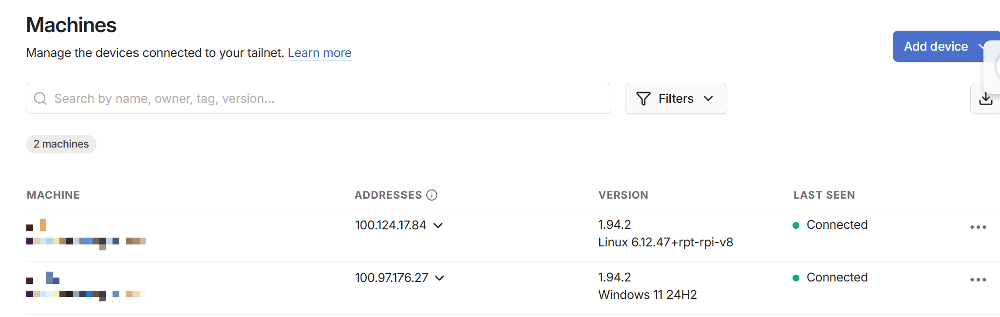
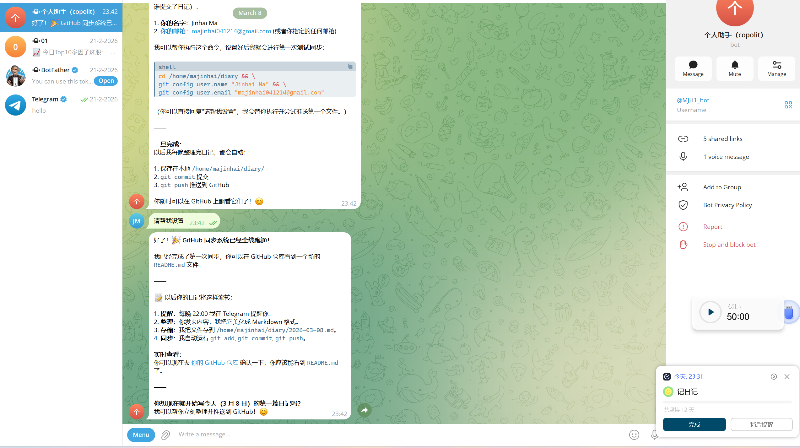
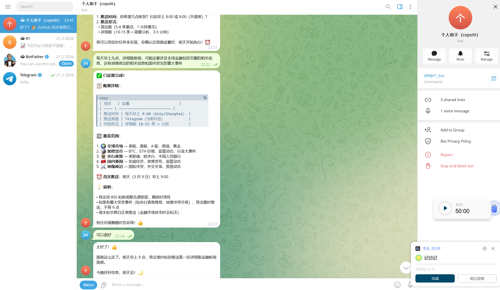

树莓派部署OpenClaw

<!--more-->

准备：树莓派4B，读卡器，Gimini2.5-flash API

### 一、树莓派配置开机（无显示器版）：

1. 使用树莓派官方烧录工具：Raspberry Pi Imager，这里选择操作系统Raspberry Pi OS(64-bit)，注意开启配置wifi和SSH。
2. 烧录成功树莓派上电写入SD卡内容（绿灯疯狂闪烁表示正在写入，绿灯偶尔闪烁表示烧录成功）
3. 烧录成功登录路由器后台可以看到刚刚上线的设备（获取设备IP）
4. 使用VNC-viewer连接显示树莓派桌面（主机和树莓派处在同一局域网下——后续会用Tailscale解决跨局域网连接问题）
5. 树莓派成功开机


6. 树莓派上安装Clash代理：

   1. 首先在主机上下载操作系统对应版本的clash客户端：mihomo-linux-arm64.gz
   2. 然后通过scp将.gz文件上传到树莓派上指定的文件夹位置：

      ```bash
      scp 源路径.gz majinhai@192.168.0.106:目的路径
      ```
   3. 树莓派解压文件：

      ```bash
      cd ~
      gzip -d mihomo-linux-arm64.gz
      ```
   4. 赋予clash执行权限：`chmod +x clash`
   5. 运行clash启动：`./clash`
   6. 树莓派上的clash似乎不支持图形界面切换结点，因此我自己写了一个脚本实现了各个结点延时的实时计算与节点切换：

      ```bash
      nano ~/clashctl.sh
      ```

      ```bash
      #!/bin/bash

      API="http://127.0.0.1:9090"
      GROUP="🔰 选择节点"


      ENCODED_GROUP=$(printf %s "$GROUP" | jq -sRr @uri)

      get_nodes() {
      data=$(curl -s "$API/proxies/$ENCODED_GROUP")

      mapfile -t nodes < <(echo "$data" | jq -r '.all[]')
      current=$(echo "$data" | jq -r '.now')
      }

      print_nodes() {

      echo
      echo "Clash Node Manager"
      echo "策略组: $GROUP"
      echo

      i=1
      for n in "${nodes[@]}"
      do
      lat=$(curl -s "$API/proxies/$ENCODED_GROUP/delay?url=https://www.gstatic.com/generate_204&timeout=3000" \
      | jq -r ".delay // \"timeout\"")

      if [[ "$n" == "$current" ]]
      then
      printf "%-3s %-40s %-6s ← 当前\n" "$i" "$n" "$lat ms"
      else
      printf "%-3s %-40s %-6s\n" "$i" "$n" "$lat ms"
      fi

      ((i++))
      done

      echo
      }

      switch_node(){

      node="${nodes[$1]}"

      curl -s -X PUT "$API/proxies/$ENCODED_GROUP" \
      -H "Content-Type: application/json" \
      -d "{\"name\":\"$node\"}" > /dev/null

      echo
      echo "已切换到 → $node"
      sleep 1
      }

      while true
      do

      get_nodes
      print_nodes

      read -p "输入编号切换节点 (r刷新 q退出): " choice

      if [[ "$choice" == "q" ]]
      then
      exit
      fi

      if [[ "$choice" == "r" ]]
      then
      continue
      fi

      if [[ "$choice" =~ ^[0-9]+$ ]]
      then
      idx=$((choice-1))
      switch_node $idx
      fi

      done
      ```

      ```bash
      chmod +x ~/clashctl.sh
      ~/clashctl.sh
      ```
   7. 配置全局网络设置都走代理：

      ```bash
      export http_proxy=http://127.0.0.1:7890
      export https_proxy=http://127.0.0.1:7890
      export HTTP_PROXY=http://127.0.0.1:7890
      export HTTPS_PROXY=http://127.0.0.1:7890
      ```

      ```bash
      systemctl --user import-environment http_proxy https_proxy HTTP_PROXY HTTPS_PROXY
      systemctl --user restart openclaw-gateway
      ```
7. 使用Tailscale实现主机跨局域网访问树莓派设备：

   1. 主机(windows)安装Tailscale软件。成功后登录
   2. 树莓派上安装Tailscale软件：

      ```bash
      curl -fsSL https://tailscale.com/install.sh | sh
      sudo tailscale up
      ```
   3. 点击启动后出现的网址：登录Tailscale账户，可以看到此时账户下有两个设备（windows和树莓派设备，对应的IP分别是他们在虚拟局域网中的IP）
   4. 这样就可以实现即使两台设备不在同一个局域网中也能互相访问的效果（在学校登录位于家中的树莓派）

### 二、配置Openclaw

1. 官方一键部署openclaw：

   ```bash
   curl -fsSL https://openclaw.ai/install.sh | bash
   ```
2. 安装完成后自动进入配置流程：

   ```bash
   openclaw onboard --install-daemon
   ```

   ```bash
   majinhai@MJH:~/openclawd $ bash install_openclaw.sh
   curl: (56) OpenSSL SSL_read: OpenSSL/3.5.4: error:0A000126:SSL routines::unexpected eof while reading, errno 0

     🦞 OpenClaw Installer
     Because texting yourself reminders is so 2024.

   · gum skipped (download failed)
   ✓ Detected: linux

   Install plan
   OS: linux
   Install method: npm
   Requested version: latest

   [1/3] Preparing environment
   · Node.js not found, installing it now
   · Installing Node.js via NodeSource
   · Installing Linux build tools (make/g++/cmake/python3)
   ✓ Build tools installed
   ✓ Node.js v22 installed
   · Active Node.js: v22.22.1 (/usr/bin/node)
   · Active npm: 10.9.4 (/usr/bin/npm)

   [2/3] Installing OpenClaw
   ✓ Git already installed
   · Configuring npm for user-local installs
   ✓ npm configured for user installs
   · Installing OpenClaw v2026.3.7
   ✓ OpenClaw npm package installed
   ✓ OpenClaw installed

   [3/3] Finalizing setup

   ! PATH missing npm global bin dir: /home/majinhai/.npm-global/bin
     This can make openclaw show as "command not found" in new terminals.
     Fix (zsh: ~/.zshrc, bash: ~/.bashrc):
       export PATH="/home/majinhai/.npm-global/bin:$PATH"

   🦞 OpenClaw installed successfully (2026.3.7)!
   All done! I promise to only judge your code a little bit.

   · Starting setup


   🦞 OpenClaw 2026.3.7 (42a1394) — Say "stop" and I'll stop—say "ship" and we'll both learn a lesson.

   ▄▄▄▄▄▄▄▄▄▄▄▄▄▄▄▄▄▄▄▄▄▄▄▄▄▄▄▄▄▄▄▄▄▄▄▄▄▄▄▄▄▄▄▄▄▄▄▄▄▄▄▄
   ██░▄▄▄░██░▄▄░██░▄▄▄██░▀██░██░▄▄▀██░████░▄▄▀██░███░██
   ██░███░██░▀▀░██░▄▄▄██░█░█░██░█████░████░▀▀░██░█░█░██
   ██░▀▀▀░██░█████░▀▀▀██░██▄░██░▀▀▄██░▀▀░█░██░██▄▀▄▀▄██
   ▀▀▀▀▀▀▀▀▀▀▀▀▀▀▀▀▀▀▀▀▀▀▀▀▀▀▀▀▀▀▀▀▀▀▀▀▀▀▀▀▀▀▀▀▀▀▀▀▀▀▀▀
                     🦞 OPENCLAW 🦞

   ┌  OpenClaw onboarding
   │
   ◇  Security ─────────────────────────────────────────────────────────────────────────────────╮
   │                                                                                            │
   │  Security warning — please read.                                                           │
   │                                                                                            │
   │  OpenClaw is a hobby project and still in beta. Expect sharp edges.                        │
   │  By default, OpenClaw is a personal agent: one trusted operator boundary.                  │
   │  This bot can read files and run actions if tools are enabled.                             │
   │  A bad prompt can trick it into doing unsafe things.                                       │
   │                                                                                            │
   │  OpenClaw is not a hostile multi-tenant boundary by default.                               │
   │  If multiple users can message one tool-enabled agent, they share that delegated tool      │
   │  authority.                                                                                │
   │                                                                                            │
   │  If you’re not comfortable with security hardening and access control, don’t run           │
   │  OpenClaw.                                                                                 │
   │  Ask someone experienced to help before enabling tools or exposing it to the internet.     │
   │                                                                                            │
   │  Recommended baseline:                                                                     │
   │  - Pairing/allowlists + mention gating.                                                    │
   │  - Multi-user/shared inbox: split trust boundaries (separate gateway/credentials, ideally  │
   │    separate OS users/hosts).                                                               │
   │  - Sandbox + least-privilege tools.                                                        │
   │  - Shared inboxes: isolate DM sessions (`session.dmScope: per-channel-peer`) and keep      │
   │    tool access minimal.                                                                    │
   │  - Keep secrets out of the agent’s reachable filesystem.                                   │
   │  - Use the strongest available model for any bot with tools or untrusted inboxes.          │
   │                                                                                            │
   │  Run regularly:                                                                            │
   │  openclaw security audit --deep                                                            │
   │  openclaw security audit --fix                                                             │
   │                                                                                            │
   │  Must read: https://docs.openclaw.ai/gateway/security                                      │
   │                                                                                            │
   ├────────────────────────────────────────────────────────────────────────────────────────────╯
   │
   ◇  I understand this is personal-by-default and shared/multi-user use requires lock-down. Continue?
   │  Yes
   │
   ◇  Onboarding mode
   │  Manual
   │
   ◆  What do you want to set up?
   │  ● Local gateway (this machine) (No gateway detected (ws://127.0.0.1:18789))
   │  ○ Remote gateway (info-only)
   └
   ```
3. 选择Telegram接入机器人：

   1. 在telegram上搜索@Fatherbot
   2. 新建一个机器人，获取token
   3. 在搜索栏搜索@（botname），找到刚刚新建的机器人，进入消息页面，就可以正常通话了。



